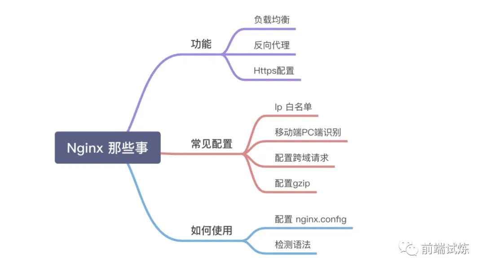

# nginx 常用命令

```nginx
    start nginx         # 启动
    nginx -s stop       # 快速关闭Nginx，可能不保存相关信息，并迅速终止web服务。
    nginx -s quit       # 平稳关闭Nginx，保存相关信息，有安排的结束web服务。
    nginx -s reload     # 修改配置后重新加载生效。
    nginx -s reopen     # 重新打开日志文件。
    nginx -c filename   # 为 Nginx 指定一个配置文件，来代替缺省的。
    nginx -t            # 配置文件检测是否正确

    nginx -v            # 显示 nginx 的版本。

    nginx -V            # 显示 nginx 的版本，编译器版本和配置参数。

    service nginx stop  # 停止
    service nginx start # 启动
    service nginx restart   # 重启
```

## nginx 无法关闭

### 如果无法关闭 ngixn 可以试下下列方案

```
    命令行输入： taskkill /F /IM nginx.exe > nul
```

## 403 无权限问题

    将整个虚拟主机开启目录流量
    在location 中加上autoindex为on;

```nginx
    location / {
            root   C:\xampp\htdocs;
            index  index.html index.htm;
            autoindex on;
    }
```

## 代理到 8080 端口（proxy_pass）

```nginx
location / {
    proxy_pass http://127.0.0.1:8080;
}
```

## nginx 配置 https

> 签署第三方可信任的 SSL 证书 和 配置 HTTPS

-   签署第三方可信任的 SSL 证书

    xxx.pem、xxx.crt 为证书文件，xxx.key 为密钥文件，需自行下载

-   配置 https
    > 要开启 HTTPS 服务，在配置文件信息块(server)，必须使用监听命令 `listen` 的 `ssl` 参数和定义服务器证书文件和私钥文件，如下所示：

```nginx
server {
    listen 443;
    server_name www.xxx.com; // 你的域名
    root /var/www/www.xxx.com; // 前台文件存放文件夹，可改成别的
    index index.html index.htm;// 上面配置的文件夹里面的index.html

    ssl on;
    ssl_certificate  xxx.pem;// 改成你的证书的名字
    ssl_certificate_key xxx.key;// 你的密钥的名字
    ssl_session_timeout 5m;
    ssl_ciphers ECDHE-RSA-AES128-GCM-SHA256:ECDHE:ECDH:AES:HIGH:!NULL:!aNULL:!MD5:!ADH:!RC4; #按照这个协议配置 这里不需要更改
    ssl_protocols TLSv1 TLSv1.1 TLSv1.2; // 按照这个协议配置 这里不需要更改
    ssl_prefer_server_ciphers on;

    location / {
        index index.html index.htm;
    }
}
```

### http 自动跳转 https（可选）

::: warning
要新加一个 server 不要写在 listen 443 里面，写在里面就一直是 https 重定向到 https，进入死循环。
:::

```nginx
server {
    listen 80;
    server_name www.xxx.com;// 你的域名
    rewrite ^(.*)$ https://$host$1 permanent;// 把http的域名请求转成https
}
```

| 配置文件参数        | 说明                                |
| ------------------- | ----------------------------------- |
| listen 443          | SSL 访问端口号为 443                |
| ssl on              | 启用 SSL 功能                       |
| ssl_certificate     | 证书文件                            |
| ssl_certificate_key | 私钥文件                            |
| ssl_protocols       | 使用的协议                          |
| ssl_ciphers         | 配置加密套件，写法遵循 openssl 标准 |

## 二级目录反向代理

<a href="https://zhang.ge/5054.html" target="_blank">Nginx 通过二级目录（路径）映射不同的反向代理，规避 IP+端口访问</a>

## Dos 命令查看端口占用及关闭进程

### 查看端口占用

在 windows 命令行窗口下执行：
`netstat -aon|findstr "8080"`

```
TCP     127.0.0.1:80         0.0.0.0:0               LISTENING       2448
```

端口“8080”被 PID（进程号）为 2448 的进程占用。

查看端口“8080”被哪个应用占用，继续执行命令：
`tasklist|findstr "2448"`

```
notepad.exe                     2016 Console                 0     16,064 K
```

### 关闭进程

1. 按进程号关闭进程  
   `taskkill /pid 2152`  
   多个时格式为：`taskkill /pid 2152 /pid 1284`

2. 按进程名关闭进程
   `taskkill /im nginx.exe`  
   指定多个时格式为：
   `taskkill /im notepad.exe /im iexplorer.exe`

3. 有提示的关闭进程

```
taskkill /t /im notepad.exe
taskkill /t /pid 2152
```

4. 强行终止进程

```
taskkill /f /im notepad.exe
taskkill /f /pid 2152
```

## nginx 那些事



> nginx 既可以作为 Web 服务器，也可以作为负载均衡服务器，具备高性能、高并发连接等

### 负载均衡

> 当一个应用单位时间内访问量激增，服务器的带宽及性能受到影响，影响大到自身承受能力时，服务器就会宕机奔溃，为了防止这种现象发生，以及实现更好的用户体验，我们可以通过配置 `Nginx` 负载均衡的方式来分担服务器压力

> 当有一台服务器宕机时，负载均衡器就分配其他的服务器给用户，极大的增加的网站的稳定性 当用户访问 web 时候，首先访问到的是`负载均衡器`，再通过负载均衡器将请求转发给后台服务器

#### 负载均衡的几种常用方式

-   轮询（默认）

```nginx
# nginx.config
upstream backserver {
  server 192.168.0.1;
  server 192.168.0.2;
}
```

-   权重 weight
    指定不同 ip 的权重，权重与访问比成正相关，权重越高，访问越大，适用于不同性能的机器

```nginx
# nginx.config
upstream backserver {
  server 192.168.0.1 weight=2;
  server 192.168.0.2 weight=8;
}
```

-   响应时间来分配
    公平竞争，谁相应快，谁处理，不过这种方式需要依赖到第三方插件 nginx-upstream-fair，需要先安装

```nginx
# nginx.config
upstream backserver {
  server 192.168.0.1;
  server 192.168.0.2;
  fair;
}

server {
  listen 80;
  server_name localhost;
  location / {
    proxy_pass  http://backserver;
  }
}
```

#### 健康检查

Nginx 自带 `ngx_http_upstream_module`（健康检测模块）本质上服务器心跳的检查，通过定期轮询向集群里的服务器发送健康检查请求,来检查集群中是否有服务器处于异常状态

如果检测出其中某台服务器异常,那么在通过客户端请求 nginx 反向代理进来的都不会被发送到该服务器上（直至下次轮训健康检查正常）

基本例子如下 👇

```nginx
upstream backserver{
  server 192.168.0.1  max_fails=1 fail_timeout=40s;
  server 192.168.0.2  max_fails=1 fail_timeout=40s;
}

server {
  listen 80;
  server_name localhost;
  location / {
    proxy_pass http://backend;
  }
}
```

涉及两个配置：

`fail_timeout` : 设定服务器被认为不可用的时间段以及统计失败尝试次数的时间段，默认为 10s  
`max_fails` : 设定 Nginx 与服务器通信的尝试失败的次数，默认为：1 次

### 反向代理

> 反向代理指的是，当一个客户端发送的请求,想要访问服务器上的内容，但将被该请求先发送到一个代理服务器 `proxy`,这个代理服务器（`Nginx`）将把请求代理到和自己属于同一个局域网下的内部服务器上,而用户通过客户端真正想获得的内容就存储在这些内部服务器上，此时 `Nginx` 代理服务器承担的角色就是一个中间人，起到分配和沟通的作用

#### 反向代理优势

-   防火墙作用  
    当你的应用不想直接暴露给客户端（也就是客户端无法直接通过请求访问真正的服务器，只能通过 Nginx），通过 `nginx` 过滤掉没有权限或者非法的请求，来保障内部服务器的安全

-   负载均衡  
    也就上一章提到负载均衡，本质上负载均衡就是反向代理的一种应用场景，可以通过 `nginx` 将接收到的客户端请求"均匀地"分配到这个集群中所有的服务器上(具体看负载均衡方式),从而实现服务器压力的负载均衡

#### 如何使用反向代理

```nginx
# 我们通过模拟内部服务器的端口启动的nodejs项目设置反向代理到80端口访问
# nginx.config
server  {
  listen 80;
  server_name localhost;
  location / {
    proxy_pass http://127.0.0.1:8000; #（upstream）
  }
}
```

在 Nginx 反向代理是，会通过 location 功能匹配指定的 URI，然后把接收到的符合匹配 `URI` 的请求通过 `proxy_pass` 转移给之前定义好的 upstream 节点池

### 常用配置

#### IP 白名单

> 可以配置 nginx 的白名单，规定有哪些 ip 可以访问你的服务器，防爬虫必备

```nginx
# 简单配置
server {
  location / {
    deny  192.168.0.1; # 禁止该ip访问
    deny  all; # 禁止所有
  }
}
```

白名单配置
建立白名单

vim /etc/nginx/white_ip.conf
...
192.168.0.1 1;
...
修改 nginx 配置(nginx.conf)

geo $remote_addr $ip_whitelist{
default 0;
include ip.conf;
}
// geo 指令主要是可以根据指定变量的值映射出一个新变量。如果不指定变量，默认为`$remote_addr`
为匹配项做白名单设置

server {
location / {
if ( $ip_whitelist = 0 ){
      return 403; //不在白名单返回 403
    }
    index index.html;
    root /tmp;
  }
}
4.2 适配PC与移动环境
当用户从移动端打开PC端baidu.com的场景时，将自动跳转指移动端m.baidu.com，本质上是Nginx可以通过内置变量$http_user_agent，获取到请求客户端的 userAgent，从而知道当前用户当前终端是移动端还是 PC，进而重定向到 H5 站还是 PC 站

server {
location / {
//移动、pc 设备 agent 获取
if ($http_user_agent ~* '(Android|webOS|iPhone)') {
      set $mobile_request '1';
}
if (\$mobile_request = '1') {
rewrite ^.+ http://m.baidu.com;
}
}
}
4.3 配置 gzip
开启 Nginx gzip，压缩后,静态资源的大小会大大的减少,从而可以节约大量的带宽,提高传输效率,带来更好的响应和体验

server{
gzip on; //启动
gzip_buffers 32 4K;
gzip_comp_level 6; //压缩级别，1-10，数字越大压缩的越好
gzip_min_length 100; //不压缩临界值，大于 100 的才压缩，一般不用改
gzip_types application/javascript text/css text/xml;
gzip_disable "MSIE [1-6]\."; // IE6 对 Gzip 不友好，对 Gzip
gzip_vary on;
}
4.4 Nginx 配置跨域请求
当出现 403 跨域错误的时候，还有 No 'Access-Control-Allow-Origin' header is present on the requested resource 报错等，需要给 Nginx 服务器配置响应的 header 参数：

location / {
add_header Access-Control-Allow-Origin \*;
add_header Access-Control-Allow-Methods 'GET, POST, OPTIONS';
add_header Access-Control-Allow-Headers 'DNT,X-Mx-ReqToken,Keep-Alive,User-Agent,X-Requested-With,If-Modified-Since,Cache-Control,Content-Type,Authorization';

if (\$request_method = 'OPTIONS') {
return 204;
}
} 5.如何使用 Nginx
通过在本地使用 Nginx，从启动、更改、重启等环节来介绍 Nginx 的基本使用

如何启动 sudo nginx
修改 nginx.conf 配置 (具体看你配置位置)vim /usr/local/etc/nginx/nginx.conf
检查语法是否正常 sudo nginx -t
重启 nginx sudo nginx -s reload
创建软链接(便于管理多应用 nginx)
当我们需要管理多个网站的 nginx，nginx 文件放在一起是最好的管理方式，一般都存在/nginx/conf.d/，我们需要把配置文件丢到 /etc/nginx/conf.d/ 文件夹下，怎样才能使这个配置文件既在程序文件夹下，又在 /etc/nginx/conf.d/文件夹下呢？

假如我们在程序文件夹下有一个 ngxin 配置文件：/home/app/app.nginx.conf 我们需要给这个文件创建一个软链接到 /etc/nginx/conf.d/ 下：

ln -s /home/app/app.example.com.nginx.conf /etc/nginx/conf.d/app.nginx.conf
这样操作之后，当我们改应用配置文件，/etc/nginx/conf.d/ 下与之对应的配置文件也会被修改，修改后重启 nginx 就能够使新的 ngxin 配置生效了。
