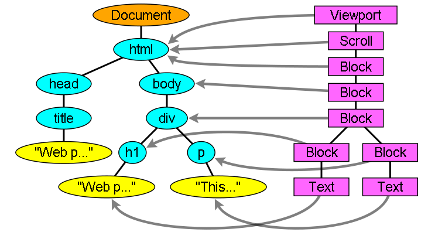

# 常见问题

## 技术 - 前端知识

-   <b>dom 树节点和渲染树节点一一对应吗，有什么是 dom 树会有，渲染树不会有的节点?</b>

    在 DOM 树构建的同时，浏览器会构建渲染树（render tree）。渲染树的节点（渲染器），在 Gecko 中称为 frame，而在 webkit 中称为 renderer。渲染器是在文档解析和创建 DOM 节点后创建的，会计算 DOM 节点的样式信息。

    在 webkit 中，renderer 是由 DOM 节点调用 attach()方法创建的。attach()方法计算了 DOM 节点的样式信息。attach()是自上而下的递归操作。也就是说，父节点总是比子节点先创建自己的 renderer。销毁的时候，则是自下而上的递归操作，也就是说，子节点总是比父节点先销毁。

    如果元素的 display 属性被设置成了 none，或者如果元素的子孙继承了 display:none，renderer 不会被创建。节点的子类和 display 属性一起决定为该节点创建什么样的渲染器。但是 visibility：hidden 的元素会被创建。

    在 webkit 中，根据 display 属性的不同，创建不同的 renderer，比如：

    (1) display:inline，创建的是 RenderInline 类型。

    (2) display:block，创建的是 RenderBlock 类型。

    (3) display:inline-block，创建的是 RenderBlock 类型。

    (4) display:list-item，创建的是 RenderListItem 类型。

    position:relative 和 position:absolute 的元素在渲染树中的位置与 DOM 节点在 DOM 树中的位置是不一样的。

    DOM 树和渲染树的对应关系如下图：

    

-   <b>CSS 会阻塞 dom 解析吗？</b>

    ```
    浏览器是解析DOM生成DOM Tree，结合CSS生成的CSS Tree，最终组成render tree，再渲染页面。在此过程中CSS完全无法影响DOM Tree，因而无需阻塞DOM解析。

    CSS 不会阻塞 DOM 的解析，但会阻塞 DOM 渲染。

    css加载会阻塞后面js语句的执行

    js会阻塞DOM树的解析，也会阻塞DOM树的渲染，但浏览器会"偷看"DOM，预先下载相关资源。

    浏览器遇到 <script>且没有 defer 或 async 属性的 标签时，会触发页面渲染，因而如果前面 CSS 资源尚未加载完毕时，浏览器会等待它加载完毕在执行脚本。

    所以，你现在明白为何<script>最好放底部，<link>最好放头部，如果头部同时有<script>与<link>的情况下，最好将<script>放在<link>上面
    ```

-   requestIdleCallback 是干什么用的

    当关注用户体验，不希望因为一些不重要的任务（如统计上报）导致用户感觉到卡顿的话，就应该考虑使用 requestIdleCallback。因为 requestIdleCallback 回调的执行的前提条件是当前浏览器处于空闲状态。

    requestAnimationFrame 的回调会在每一帧确定执行，属于高优先级任务，而 requestIdleCallback 的回调则不一定，属于低优先级任务。

-   浏览器的渲染原理

*   浏览器的渲染过程

*   关键渲染路径详述

*   避免回流的方式

*   跨域的方式

*   前端的网络安全如何防御（xss，csrf）

*   cookies 的保护方式

*   浏览器的缓存机制

*   什么文件用强缓存，什么文件用协商缓存

*   React-Native 的原理，优缺点

*   react 的虚拟 dom 和 diff 描述

*   react 渲染优化（class，hook）

*   react 的 context 的使用场景

*   node 和后端知识

*   mysql 和 mongo 的区别，使用情景

*   node 有什么情况会导致内存溢出

*   node 的内存分配

*   event loop（浏览器和 node）

*   开放性题目

*   首屏优化方案

*   在 App 中如何实现前端资源离线缓存（方案）

*   算法

const arr = [101,19,12,51,32,7,103,8];

1.找出连续最大升序的数量

2.找出不连续最大升序的数量

## 二面-技术面

晚上，视频面试，属于其他部门同事。

前端知识

浏览器的输入 url 后的过程

js 异步方式

promise.resolve 是干嘛的

promise.then 如何实现链式调用

promise.then 不返还一个 promise 还能用 then 吗

promise.finally 的作用，如何自己实现 finally

promise 原理

webpack 的异步加载如何实现

webpack 的分包策略

跨域方式有什么

jsonp 的原理

csrf 防御手段

cookie 的 samesite 属性作用

js 对象循环引用会导致什么问题

react 如何阻止原生默认事件

react 的 fiber 节点树是什么数据结构，为什么要用这样的数据结构

react 异步渲染原理，优先级如何划分

react hook 有自己做一些自定义的 hook 吗

react key 的原理

react 如何实现函数式调用组件，toast.show()

react 新增了什么生命周和删除了什么生命周期，为什么要删除

node 后端知识

node 对于 option 请求如何处理

node 如何处理 cors 跨域

ES modules 和 commonjs 的区别

node 的 event loop 和浏览器的区别

dns 查询过程，dns 用什么协议发起 dns 查询的

tcp 和 udp 区别

tcp 的三次握手和四次挥手

协商缓存和强缓存的区别

https 协议握手大概过程

对称加密和非对称加密的区别

非对称加密，私钥和公钥的区别

https 证书的作用

其他

如何埋点，为什么用 1\*1 像素的 gif 图片做上报

如何定义首屏

算法

// 从扑克牌中随机抽 5 张牌，判断是不是一个顺子，即这 5 张牌是不是连续的。2 ～ 10 为数字本身，A 为 1，J 为 11，Q 为 12，
K 为 13，而大、小王为 0 ，可以看成任意数字。A 不能视为 14。

// 示例 1:

// 输入: [1,2,3,4,5]

// 输出: True

// 示例 2:

// 输入: [0,0,1,2,5]

// 输出: True

// 限制：

// 数组长度为 5

// 数组的数取值为 [0, 13] .

## 三面-技术面

早上，视频面试，leader 面试

前端知识

绑定事件有多少种方式

事件触发的流程，捕获和冒泡

捕获阶段能终止吗

终止冒泡阶段有哪些

如果实现 one 绑定事件

事件委托的原理

event.target 和 event.currtager 的区别

浏览器显示一个图片有什么方式

如何获取 url 中的?后的参数

浏览器的内存回收机制 标记清除还是引用计数？

如何解决跨域

什么是简单请求什么复杂请求

const 和 let 有什么区别

ES6 常用的 api 有哪些

数组断引用的方式有什么

Base64 图片有什么问题

node 后端知识

Http 强缓存和协商缓存用的是什么字段，整体流程是怎样

Https 原理

Https 第一次请求会携带什么

Ca 证书的内容是什么

Https2.0 的特性

xss 攻击原理的防御方式

Csrf 攻击原理和防御方式

二进制分帧的具体是什么

Keep alive 和多路复用的区别

Option 请求的作用

Node gc 方式

新生代和老生代的区别

新生代内存地址移动到老生代内存地址的过程

开放问题

长列表优化方案

首屏优化方案

Node 如何保证第三方接口的稳定性

## 四面-GM 面

浏览器从写入 url 到加载完毕的流程

浏览器白屏原因

页面打开后 cpu 和内存快速增长，如何定位问题，可能有什么问题

长列表优化，以及长列表中，如果带搜索功能如何实现

## 五面-技术委员会技术面

最新规定 9 级及以上级别需要 1-5 轮的技术委员会进行加面。

最满意的项目列举 2 个

为什么使用 RN

有 100 匹马，场地只有 4 条跑道，得出最快的 4 只马需要多少轮 Lam：100 匹马，4 个赛道，找出跑最快的 4 匹马。

已知函数 fn1 会随机返回 1-5 的整数，要求基于 fn1 编写 fn2，要随机生成 1-7，fn2 内不能使用系统的随机 api，只能调用
fn1 获取随机数

## 六面-技术委员会技术面

前端的未来发展的一些思考

Serverless 的优缺点，前端的应用范围

页面性能优化

做过的专项的架构图

## 七面-HR 面

为什么离职

你现在公司最有成就感的项目是什么

你现在公司最有挑战的项目是什么，你是如果解决难题的

期望薪酬

因为我以前有其他公司的工作经验，所以需要做性格测试，之后就是等出薪酬方案和 hr 沟通，然后发 offer，offer 后进入
背调，一切通过后进入入职预约流程，之后就等待入职咯~~~。

总体感受

现在前端除了一些基本的面试知识外，明显感觉到算法的考虑在逐步加强，所以也总结一些重点的考点吧。一些很基本的
原理我就不写了，什么闭包，什么原型链

对 JavaScript 的 Api 可以手写。

bind

new

promise

.....

浏览器的加载原理，回流重绘，url 输入后的流程，关键渲染路径等....

框架的原理，了解你最常用的框架的内部原理以及实现，包括思想等。

浏览器和 node 的 GC 原理

浏览器和 node 之间 eventLoop 的区别

webpack 的基本原理

数据库，redis，nginx 的一些基本概念以及基本原理和优化。

对于前端页面的优化方案，包括首屏加载，资源整合，网络优化，长列表优化等

网络安全，xss，csrf，cookies 保护等

网络知识

tcp

https 和 http

dns

udp

算法和数据结构

基本常用排序

链表操作

树结构操作

贪心算法

回溯算法

双指针操作

哈希表

动态规划（一般为加分题）

```

```
