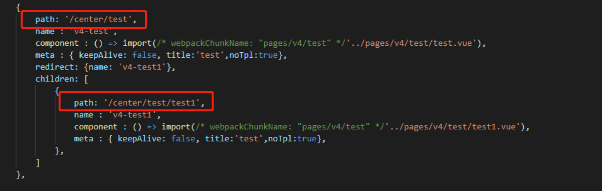

# vue

## props 正确写法

Vue 的组件中的 props 尽量以下列方式书写：  
正确写法：
```
props: {
    pro1: {
        type: Object,
        default: function(){
            return {
                a: 1,
                b: 2
            }
        }
    },
    Pro2: {
        type: Boolean,
        default: function(){
            return true
        }
    }
}
```
不推荐写法：
```
Props: ['pro1', 'pro2']
```
## 子路由高亮父路由
::: tip 常用于菜单高亮
按下图配置，可以跳转到子路由的时候高亮父级路由的router-link标签上的active-class
```
<!-- active-class会触发显示 -->
<router-link active-class="menu-active" :to="{name: 'v4-test'}">测试</router-link>
```
:::



## npm run dev 无法启动

```
1.  netstat -ano //查看所有端口
2.  http协议里的某个进程占用了80，但是在任务管理器显示的是System,最后发现是http协议的某个进程占用（发现的过程也是在网上搜索得知道，这个进程显式停止是无法停止的，只有在cmd.exe里使用net stop http来停止
3.  Sc config http start = disabled
```

## package.json 设置环境变量

::: tip 设置和访问环境变量
设置环境变量 NODE_ENV：  
set NODE_ENV=test && node build/build.js  
访问变量 NODE_ENV：  
console.log(process.env.NODE_ENV)
:::

```
// egg
"build": "set NODE_ENV=production && webpack --config build/dist.js --progress --colors",
```

## node-sass构建失败
node-sass构建失败，重新构建执行：  
npm rebuild node-sass

## 拖放事件
拖放事件：必须给拖放区元素添加 dragover.prevent，才能使 drop 事件正确执行
```
<div style="border:1px solid red;height: 100px;width:300px;" @drop="drop" @dragover.prevent>
    <p style="color:#ccc;">{{this.dropData}}</p>
</div>
```

## 路由跳转一直带上参数
``` js
router.beforeEach((to, from, next) => {
    if (Object.keys(to.query).length) {
        next();
        return;
    }
    // 对URL路径参数进行处理
    if (Object.keys(from.query).length) {
        let toQuery = JSON.parse(JSON.stringify(from.query));
        next({ path: to.path, query: toQuery });
    } else {
        next();
    }
});
```
## 优化点细节
```
1. vFor和vIf不要一起使用
2. vFor 是不推荐使用 index 下标来作为 key 的值
3. 长列表 推荐使用 vue-virtual-scroller
4. 图片懒加载
5. 路由按需加载
   // require法
    component: resolve=>(require(['@/components/HelloWorld'],resolve))

    // import
    component: () => import('@/components/HelloWorld')
6. 最小化JS文件
    config.optimization.minimize(true);
7. 图片资源压缩（可以通过 image-webpack-loader 插件对打包的图片进行压缩）
    config.module
      .rule('images')
      .use('image-webpack-loader')
      .loader('image-webpack-loader')
      .options({
        bypassOnDebug: true
      })
      .end()
8. 打包公共代码
    在 webpack4 中，可以通过 optimization.minimize 将公共代码进行打包
    new webpack.optimize.CommonsChunkPlugin({
      name: ['vendor','runtime'],
      filename: '[xxxxx].js'
    })
9. 删除沉淀代码
    使用 Tree-Shaking 插件可以将一些无用的沉淀泥沙代码给清理掉。
10. 依赖库CDN加速
    // 在html引入script标签后。在vue的配置中，进行声明
    configureWebpack: {
      externals: {
        'echarts': 'echarts' // 配置使用CDN
      }
    }
11. GZIP
    这个东西需要后端进行配置，当然，如果你有操作 Nginx 的权限的话，那么可以自己开启
    
12. CDN + Gzip + Prerender
    https://blog.csdn.net/haochuan9421/article/details/82962835
```
